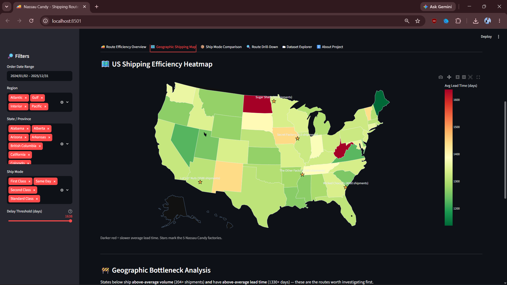
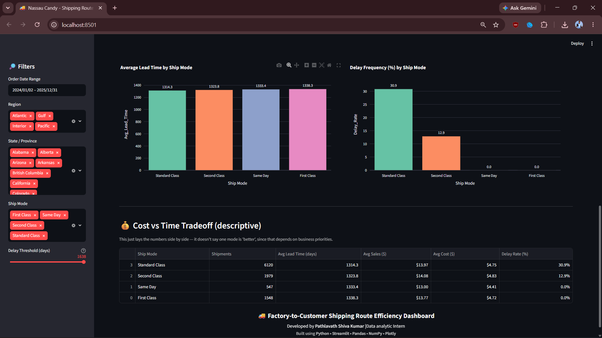
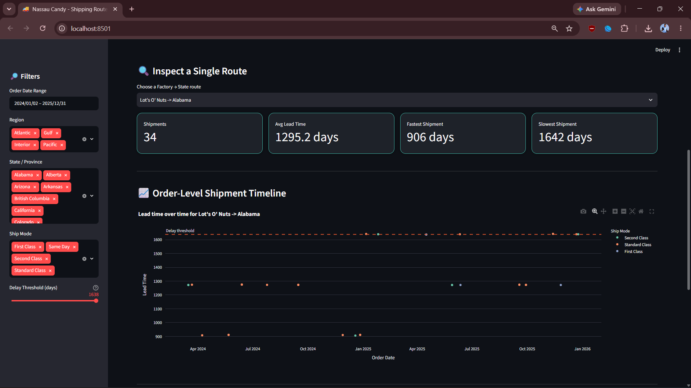
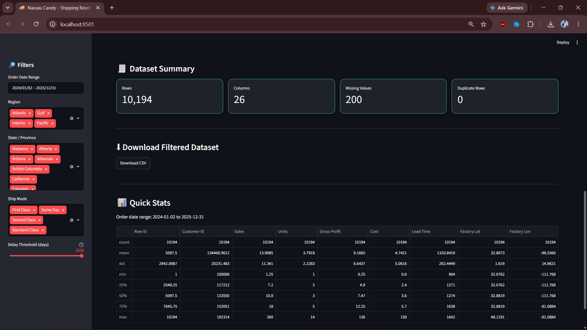

# 🚚 Factory-to-Customer Shipping Route Efficiency Dashboard

An interactive **logistics analytics dashboard** built with **Streamlit, Pandas, NumPy, and Plotly** that turns Nassau Candy Distributor's raw order and shipment data into route-level operational intelligence — which factory-to-customer lanes are fast, which ones are consistently slow, and where the geographic bottlenecks sit.


---

---

# 🚀 Dashboard Preview

## 🏠 Dashboard Home


---

## 🚚 Route Efficiency Overview


---

## 🗺️ Geographic Shipping Map


---

## 📦 Ship Mode Comparison


---

## 🔍 Route Drill-Down


---

## 🗂 Dataset Explorer


---

## ℹ️ About Project


---

## 📌 Background

Nassau Candy Distributor ships candy from 5 factories to customers across the US and Canada. Despite having detailed order and shipment records, the business had no route-level visibility into shipping performance — logistics decisions were being made reactively instead of being backed by data. This project builds that visibility from the ground up: cleaning the raw order data, engineering a shipping-lead-time metric, mapping every product back to the factory that makes it, and packaging the results into a filterable dashboard.

---

## 📑 Deliverables

- **Streamlit dashboard** — this repo, run via `streamlit run app.py`
- **Research paper** — [`docs/Research_Paper.docx`](docs/Research_Paper.docx), covering the full methodology, exploratory data analysis, findings, and recommendations
- **Executive summary** — [`docs/Executive_Summary.docx`](docs/Executive_Summary.docx), a short stakeholder-facing writeup

---

## ❓ Problem Statement

Without route-level intelligence, the organization couldn't answer basic operational questions:

- Which factory → customer routes are consistently efficient?
- Which routes experience frequent delays?
- How does shipping performance vary by region, state, and ship mode?
- Where are the geographic bottlenecks?

This dashboard answers all four.

---

## ✨ Features

### 🔎 Interactive Filters
- Order date range
- Region / State selector
- Ship mode filter
- Delay-threshold slider (used to flag "delayed" shipments across every KPI)

### 📊 KPI Dashboard
- Total Shipments
- Average Lead Time
- Lead Time Variability (standard deviation)
- Delay Frequency (%)
- Active Routes
- Factories in Use

### 🚚 Route Efficiency Overview
- Top 10 fastest and bottom 10 slowest factory → state routes
- Full route leaderboard with a normalized 0–100 Route Efficiency Score
- Route volume vs. lead time bubble chart

### 🗺️ Geographic Shipping Map
- US choropleth colored by average lead time, with factory locations overlaid
- Automatic bottleneck detection (states with above-average volume *and* above-average lead time)
- Separate table for cross-border (Canadian) shipments, which sit outside the US map

### 📦 Ship Mode Comparison
- Lead time distribution by ship mode (box plot)
- Average lead time and delay rate by ship mode
- Descriptive cost-vs-time tradeoff table (no value judgment — just the numbers side by side)

### 🔍 Route Drill-Down
- Pick any single factory → state route and see its order-level shipment timeline
- Fastest / slowest individual shipments, full order-level table

### 🗂 Dataset Explorer
- Row/column counts, missing values, duplicate rows
- Filtered CSV export
- Descriptive statistics

---

## 🖥️ Tech Stack

| Tool | Purpose |
|------|---------|
| Python | Core language |
| Streamlit | Dashboard framework / UI |
| Pandas | Data cleaning, feature engineering & aggregation |
| NumPy | Numerical operations |
| Plotly | Interactive charts & the US choropleth map |

---

## 📂 Project Structure

```
Nassau-Shipping-Route-Analysis/
│
├── app.py                              # Main Streamlit application
├── analysis.ipynb                      # Jupyter notebook: standalone EDA walkthrough
├── requirements.txt                    # Python dependencies
├── README.md                           # Project documentation
├── LICENSE                             # MIT License
├── .gitignore
│
├── data/
│   └── Nassau_Candy_Distributor.csv     # Source order & shipment dataset
│
├── images/
│   ├── dashboard-overview.png           # Landing dashboard with title, KPI cards, filters, and Route Efficiency Overview
│   ├── route-performance.png            # Top 10 & Bottom 10 routes and complete Route Performance leaderboard
│   ├── route-volume-vs-leadtime.png     # Bubble chart comparing shipment volume against average lead time
│   ├── shipping-heatmap.png             # Interactive US choropleth map showing shipment density and factory locations
│   ├── ship-mode-boxplot.png            # Box plot visualizing lead time distribution across shipping modes
│   ├── ship-mode-analysis.png           # Shipping mode comparison with average lead time, delay rate, and cost–time trade-off
│   ├── route-drilldown.png              # Detailed single-route analysis with shipment timeline and order-level information
│   └── dataset-explorer.png             # Dataset summary including rows, columns, missing values, duplicates, and statistics
│
└── docs/
    ├── Research_Paper.            # Full EDA, methodology, findings & recommendations
    └── Executive_Summary.        # Stakeholder-facing summary
```

---

## 🚀 Getting Started

### 1. Clone the repository
```bash
git clone https://github.com/<your-username>/Nassau-Shipping-Route-Analysis.git
cd Nassau-Shipping-Route-Analysis
```

### 2. Install dependencies
```bash
pip install -r requirements.txt
```

### 3. Run the dashboard
```bash
streamlit run app.py
```

The app opens automatically at `http://localhost:8501`.

### 4. (Optional) Run the analysis notebook
```bash
jupyter notebook analysis.ipynb
```
`analysis.ipynb` walks through the same cleaning, feature engineering, and analysis steps as `app.py`, step by step, with every cell already executed against the current dataset — open it to read the full EDA outputs and charts, or re-run it top to bottom (Kernel → Restart & Run All) against a refreshed CSV.

---

## 📊 Dataset

The dashboard reads `data/Nassau_Candy_Distributor.csv`, which contains one row per order line item with the following fields:

`Row ID`, `Order ID`, `Order Date`, `Ship Date`, `Ship Mode`, `Customer ID`, `Country/Region`, `City`, `State/Province`, `Postal Code`, `Division`, `Region`, `Product ID`, `Product Name`, `Sales`, `Units`, `Gross Profit`, `Cost`.

Each product is manufactured at exactly one of 5 factories, mapped internally in `app.py`:

| Factory | Latitude | Longitude |
|---|---|---|
| Lot's O' Nuts | 32.881893 | -111.768036 |
| Wicked Choccy's | 32.076176 | -81.088371 |
| Sugar Shack | 48.119140 | -96.181150 |
| Secret Factory | 41.446333 | -90.565487 |
| The Other Factory | 35.117500 | -89.971107 |

> Make sure the CSV stays inside the `data/` folder — the app looks for it at exactly that relative path.

---

## 🧮 Methodology (short version)

1. **Clean** — parse dates, coerce numeric fields, drop incomplete records, discard any negative lead times.
2. **Engineer** — compute `Lead Time = Ship Date − Order Date`, attach each row's factory via the product lookup table, and build a `Factory → State` and `Factory → Region` route label.
3. **Aggregate** — group by route to get shipment counts, average lead time, and lead time variability.
4. **Benchmark** — rank routes fastest-to-slowest, compute a normalized 0–100 efficiency score, and compare across ship modes.
5. **Flag bottlenecks** — cross-reference shipment volume against lead time at the state level to surface routes worth investigating first.

---

## 💡 Key Findings

- Average shipping lead time across all orders is a little over **1,320 days** in this dataset, with real variation across states and ship modes rather than a flat number.
- **Standard Class** shipments had the lowest average lead time of the four ship modes, while **First Class** was, somewhat counter-intuitively, the slowest on average — a pattern worth validating against the source data rather than taking at face value.
- **Nevada** and **Virginia** were the fastest-performing states (with a meaningful shipment volume), while **Iowa** and **New Mexico** consistently lagged behind.
- **Lot's O' Nuts** and **Wicked Choccy's** (the two chocolate factories) handle the large majority of shipment volume, so their route performance has an outsized effect on overall logistics KPIs.
- The Gulf region posted a slightly lower average lead time than the Interior, Atlantic, and Pacific regions.

---

## 🔮 Future Improvements

- Route-level forecasting to flag routes likely to slip before they actually delay
- Postal-code-level mapping instead of state-level, once precise geocoding is available
- Automated anomaly detection for sudden spikes in a route's lead time
- Integration with a live order-management system instead of a static CSV export
- Cost-time optimization model to recommend the cheapest ship mode that still meets a target delivery window

---

## 📄 License

This project is licensed under the [MIT License](LICENSE).

---

## 🙋 Author

**Pathlavath Shiva Kumar**
  

Feel free to fork, star ⭐, or open an issue with suggestions!
